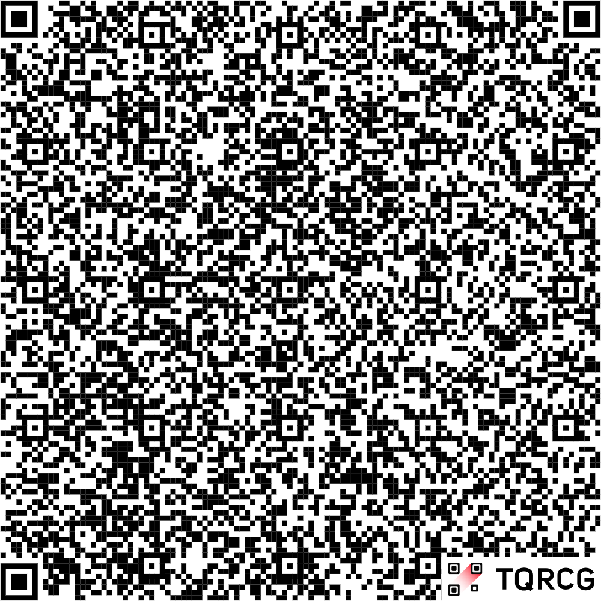

# FreshTrack

FreshTrack is a mobile application designed to help you keep track of your groceries, reduce food waste, and maintain an organized refrigerator. By scanning QR codes, you can effortlessly add items with their expiry dates, ensuring you always know what's fresh.

## Prerequisites

Before you begin, ensure you have the following installed and set up:

- **Git:** You'll need Git to clone the repository.
- **Node.js and npm:** Node.js version 16 or later is recommended. This installation includes `npm` (Node Package Manager). Your `npm` version must be **10.5.0** or higher.
- **Expo Go App:** Install the Expo Go application on your mobile device.
  - [Download for iOS (App Store)](https://apps.apple.com/us/app/expo-go/id982107779)
  - [Download for Android (Google Play)](https://play.google.com/store/apps/details?id=host.exp.exponent)

## 🚀 Getting Started

Follow these steps to get the application running on your local machine and mobile device.

1.  **Clone the Repository**
    Open your terminal and run the following command to clone the project to your local machine:

    ```bash
    git clone https://github.com/RCPilot1604/FridgeGang.git
    ```

2.  **Install Dependencies**
    Navigate into the project's primary directory (`freshTrack`) and install the required packages.

    ```bash
    cd freshTrack
    npm install
    ```

3.  **Connect to the Same Network**
    Ensure your development machine (PC/laptop) and your mobile phone are connected to the **same Wi-Fi network**.

    > **💡 Pro Tip:** For a more stable connection, you can connect your computer to your phone's mobile hotspot.

4.  **Start the Development Server**
    Run the start script to launch the Metro Bundler.

    ```bash
    npm run start
    ```

    Once it's running, a QR code will be displayed in the terminal. Make sure the output confirms it is `Using Expo Go`.

5.  **Launch the App**
    Open the **Expo Go** app on your phone and scan the QR code from your terminal. The FreshTrack app will build and launch on your device.

## 📱 Using the App

### Adding New Items

You can add one or more items to your fridge list by scanning a specially formatted QR code.

1.  Press the **`+`** icon on the home screen.
2.  This will open your phone's camera.
3.  Scan a valid QR code to add new items. For a quick test, use the image displayed below.

    **Note:** If the image doesn't display correctly, the file is also available in the project's root directory as `example_QR_code.png`.

    

### Creating Your Own QR Codes

To add your own groceries, you need to generate a QR code containing the item data in a specific JSON format.

1.  Go to a QR code generator website, for example, [The QR Code Generator](https://www.the-qrcode-generator.com/).
2.  Choose the **"Text"** or **"Plain Text"** option.
3.  Paste a JSON array into the text field. The JSON must follow the structure below.

#### JSON Data Structure

The QR code must contain a JSON array where each object represents a single grocery item.

| Field           | Type                | Description                                                   | Required |
| :-------------- | :------------------ | :------------------------------------------------------------ | :------- |
| `item_name`     | `String`            | The name of the grocery item.                                 | Yes      |
| `purchase_date` | `String (ISO 8601)` | The date and time of purchase (e.g., `YYYY-MM-DDTHH:mm:ssZ`). | Yes      |
| `expiry_date`   | `String (ISO 8601)` | The expiration date of the item.                              | Yes      |
| `category`      | `String`            | The category of the item (e.g., "Dairy", "Meat").             | Yes      |

#### Example JSON Payload

Here is an example of a valid JSON array that you can use to generate a QR code.

```json
[
  {
    "item_name": "Bavarian Pretzels",
    "purchase_date": "2025-06-26T16:45:00Z",
    "expiry_date": "2025-07-03T12:00:00Z",
    "category": "Pantry"
  },
  {
    "item_name": "Weisswurst",
    "purchase_date": "2025-06-25T10:00:00Z",
    "expiry_date": "2025-06-28T12:00:00Z",
    "category": "Meat"
  },
  {
    "item_name": "Organic Milk",
    "purchase_date": "2025-06-15T09:00:00Z",
    "expiry_date": "2025-06-20T12:00:00Z",
    "category": "Dairy"
  }
]
```
